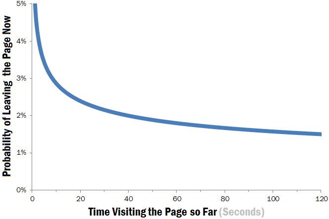

# Meet Monty The Professional Python Chatbot

## The problem:
As online users have become used to the fast-paced microwave lifestyle, their immediate need and attention are of utmost important. According to research done by Neilsen Norman Group “Users often leave Web pages in 10–20 seconds, but pages with a clear value proposition can hold people's attention for much longer.” (Nielsen 2011) 

“It's clear from the chart that the first 10 seconds of the page visit are critical for users' decision to stay or leave. The probability of leaving is very high during these first few seconds because users are extremely skeptical, having suffered countless poorly designed web pages in the past. People know that most web pages are useless, and they behave accordingly to avoid wasting more time than absolutely necessary on bad pages.” (Nielsen 2011)

## The question:
So what can we do engage the users in a way that will not leave them skeptical or give the impression that the website is poorly designed?

## The solution:
A chatbot! Yes, “chatbots are beneficial for both parties: developing chatbots is cheaper than training and hiring human customer service agents for the company, and customers often prefer a brisk mobile interaction over talking with someone in person or with the call center. Consider this statistic from Gartner, that artificial intelligence will amount for 85% of customer relationships by 2020.” (Morgan 2017)

## Purpose:
The purpose of this chatbot is to have a an **easy to implement chatbot that only uses a csv containing questions and response**. This can be used to enhance customer experience with the frequently asked questions and answer immediately on any website. This model can be quickly implemented for any online business.

## Benefits:
This will benefit the company with an immediate customer engagement, as shown on the diagram after the first 20 seconds users are more likely to stay long term. In addition this will add effeciency and lower overhead on employee cost for the company.